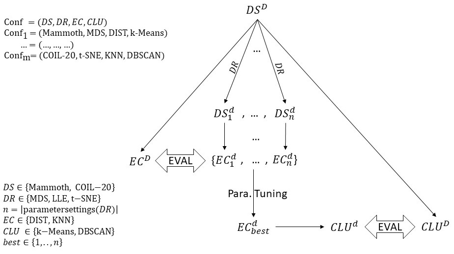

# Bachelor Thesis (LaTeX project) 

Short repository for a Bachelor's thesis written in LaTeX. This repo contains the source files, figures and data used to build the [final PDF](Bachelorarbeit___Atakan_Kara.pdf) of the thesis. 

**NOTE: THIS THESIS IS RELATED TO THE [CODE FRAMEWORK](https://github.com/atakan-kara99/ManifoldLearningFramework).**

### Title: A Comparison of Manifold Learning Methods

## Abstract

In an era marked by the expansion of high-dimensional data, the art of extracting meaningful insights from complex datasets has become indispensable. Manifold learning methods have emerged as powerful tools for transforming and visualizing data while preserving as many relationships as possible. This thesis presents a comparative study of three prominent manifold learning techniques: Multi-Dimensional Scaling (MDS), Locally Linear Embedding (LLE), and t-Distributed Stochastic Neighbor Embedding (t-SNE). The work centers on three diverse datasets, the 3D-Mammoth dataset, a transformed version of it, and the COIL-20 dataset, each presenting unique challenges and characteristics. We evaluate the performance of these methods in terms of distance and neighborhood preservation, visualization quality, and clusterability on embeddings. Our findings reveal that MDS excels at all types of tasks and the fact that it has no parameter to tune makes it a great choice for potentially all kinds of tasks. LLE, on the other hand, proves robust in preserving local and global structures at a given threshold for its parameter setting. However, its computational complexity renders it unfeasible on datasets with many datapoints. Similar or even better results can be achieved by deploying t-SNE which stands out in the task of neighborhood preservation, especially for low parameter settings. As the machine learning landscape continues to evolve, this thesis contributes to the ongoing exploration of these manifold leanring methods, equipping data scientists and researchers with the essential knowledge to navigate the complex terrain of dimensionality reduction.

## Roadmap

The project pipeline is included as a PDF in the repository and can be viewed below.

## What this repository contains

- `main.tex` — top-level LaTeX file (entry point)
- `abstract.tex`, `introduction.tex`, `theoretical_foundation.tex`, `related_work.tex`, `methodology.tex`, `results.tex`, `summary_and_outlook.tex`, `appendix.tex` — chapter/source files
- `bibliography.bib` — BibTeX bibliography file
- `images/` — directory with figures and dataset visualizations
